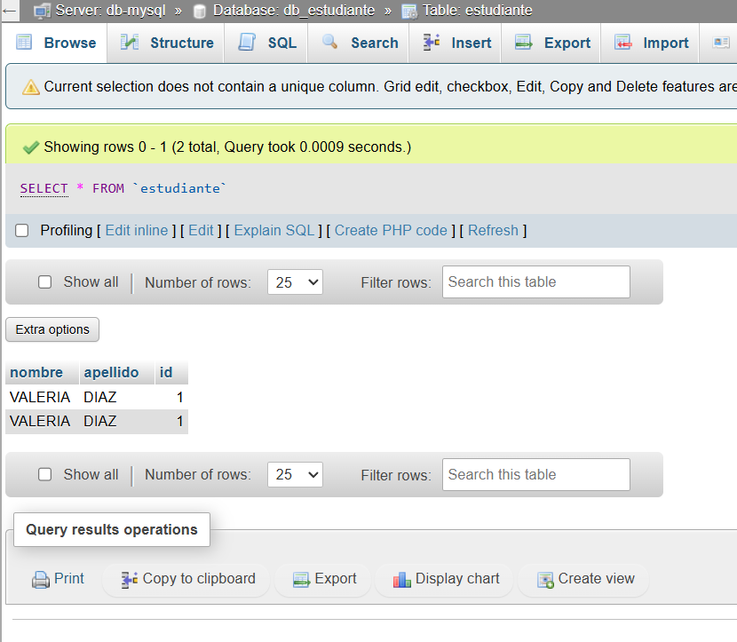
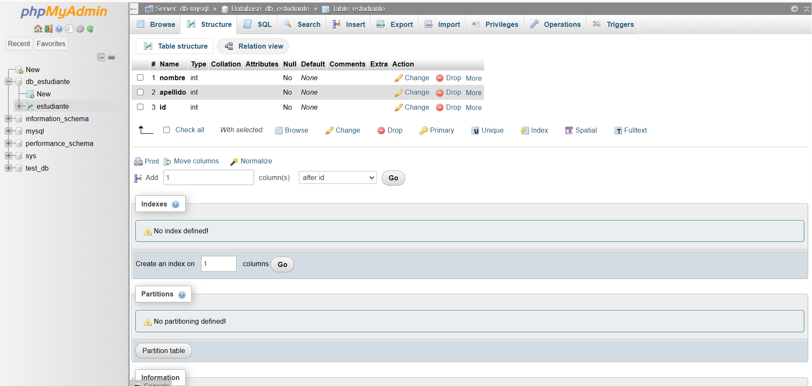

# Practica servidor web

## 1. Titulo
Despliegue de infraestructura de base de datos y administración mediante contenedores Docker y redes personalizadas.

## 2. Tiempo de duración
60 minutos.

## 3. Fundamentos:

La tecnología de contenedores ha revolucionado el desarrollo de software moderno al permitir ejecutar aplicaciones en entornos aislados pero ligeros. A diferencia de las máquinas virtuales, los contenedores comparten el núcleo del sistema anfitrión, lo que reduce el consumo de recursos y mejora el rendimiento.

En esta práctica se utiliza Docker, una plataforma que permite crear, ejecutar y gestionar contenedores de manera eficiente. Docker facilita el despliegue de aplicaciones mediante imágenes preconfiguradas, lo que asegura consistencia entre entornos de desarrollo y producción.

Se implementan dos servicios principales: MySQL, que es un sistema de gestión de bases de datos relacional ampliamente utilizado para almacenar información estructurada, y phpMyAdmin, una herramienta web que permite administrar bases de datos de forma gráfica sin necesidad de usar comandos SQL directamente.

Un concepto clave en esta práctica es el Docker Networking. Al crear una red de tipo bridge, los contenedores pueden comunicarse entre sí utilizando nombres como si fueran direcciones IP, gracias a un DNS interno que Docker gestiona automáticamente. Esto permite que phpMyAdmin se conecte a MySQL usando el nombre del contenedor.

También se utilizan variables de entorno, que permiten configurar parámetros importantes como contraseñas de acceso sin necesidad de modificar archivos internos del contenedor. Esto mejora la seguridad y la flexibilidad del sistema.

Otro aspecto importante es el aislamiento, ya que cada contenedor funciona de manera independiente, evitando conflictos entre dependencias o configuraciones.


## 4. Conocimientos previos.
   
Para realizar esta practica el estudiante necesita tener claro los siguientes temas:
- Comandos básicos de Linux (terminal)
- Manejo de navegador web
- Conceptos básicos de bases de datos (tablas, registros, claves primarias)
- Puertos y redes (cliente-servidor)

## 5. Objetivos a alcanzar
   
- Implementar contenedores para MySQL y phpMyAdmin  
- Configurar una red personalizada en Docker  
- Establecer comunicación entre servicios mediante nombre de host  
- Crear bases de datos y tablas  
- Insertar registros utilizando herramientas gráficas  

## 6. Equipo necesario:
  
- Computador con sistema operativo Windows/Linux/Mac  
- Entorno Docker Desktop o Killercoda  
- Docker Engine v24.0.0 o superior  
- Navegador web actualizado  

## 7. Material de apoyo.
   
- Documentación de Docker   
- Cheat sheet de comandos Docker y SQL  

## 8. Procedimiento

Paso 1: Crear la red de datos  
```bash
docker network create red-datos
```

Paso 2: Ejecutar contenedor MySQL  
```bash
docker run -d --name db-mysql \
--network red-datos \
-e MYSQL_ROOT_PASSWORD=mi_password_segura \
mysql:8.0
```

Paso 3: Ejecutar phpMyAdmin  
```bash
docker run -d --name interfaz-pma \
--network red-datos \
-e PMA_HOST=db-mysql \
-p 8080:80 \
phpmyadmin:latest
```

Paso 4: Configurar base de datos  
- Ingresar a http://localhost:8080  
- Crear base de datos: db_estudiante  
- Crear tabla: estudiante  
- Insertar registros  

Figura 8-1. Interfaz de phpMyAdmin con datos insertados  


## 9. Resultados esperados:
    
Se logró implementar una arquitectura funcional usando contenedores.

- MySQL ejecutándose correctamente  
- phpMyAdmin conectado al servidor  
- Base de datos creada  
- Tabla estudiante con registros  




## 10. Bibliografía
    
- Docker Inc. (2024). Docker Documentation: Network Guide  
- Oracle Corp. (2024). MySQL 8.0 Reference Manual  
- phpMyAdmin Project. (2024). User Guide and Documentation  
